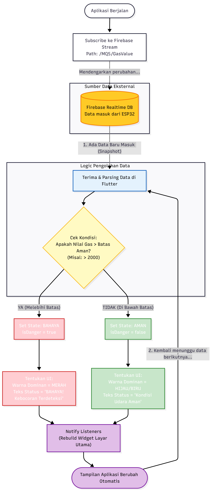

# 🛡️ Smart Gas Guard

**Sistem Monitoring Kebocoran Gas LPG berbasis IoT (ESP32 + Firebase RTDB + Flutter)**


**Proteksi cerdas, hunian berkelas.**
Deteksi dini kebocoran gas LPG secara real‑time, langsung ke genggaman.

---

## 📌 Ringkasan

**Smart Gas Guard** adalah solusi keamanan rumah berbasis IoT untuk mendeteksi potensi kebocoran gas LPG menggunakan sensor **MQ‑5**. Sistem mengirim pembacaan sensor ke **Firebase Realtime Database (RTDB)** melalui **ESP32**, lalu aplikasi **Flutter** memantau data secara *real‑time* untuk menampilkan status **Aman/Bahaya**.

> Target utama: monitoring kontinu + perubahan UI instan saat melewati ambang bahaya.

---

## 🧭 Daftar Isi

* [Fitur Unggulan](#-fitur-unggulan)
* [Arsitektur Sistem](#-arsitektur-sistem)
* [Spesifikasi & Konfigurasi Hardware](#-spesifikasi--konfigurasi-hardware)
* [Pengembangan Aplikasi Mobile](#-pengembangan-aplikasi-mobile)
* [Struktur Data Firebase](#-struktur-data-firebase)
* [Panduan Instalasi](#-panduan-instalasi-lengkap)
* [Kalibrasi & Threshold](#-kalibrasi--threshold)
* [Troubleshooting / FAQ](#-troubleshooting--faq)
* [Roadmap](#-roadmap)
* [Kontribusi](#-kontribusi)
* [Lisensi](#-lisensi)

---

## ✨ Fitur Unggulan

* **📡 Real‑time Telemetry** — pemantauan kadar gas (nilai analog/PPM estimasi) secara kontinu.
* **⚠️ Smart Alert System** — status otomatis berdasarkan *threshold*.

  * 🟢 **Aman**: UI hijau/biru (nilai `< 2000`)
  * 🔴 **Bahaya**: UI merah + peringatan teks (nilai `> 2000`)
* **☁️ Cloud Integration** — sinkronisasi nirkabel via Google Firebase RTDB.
* **📱 Responsif UI** — tampilan adaptif berbagai ukuran layar.

---

## 🏗 Arsitektur Sistem

Diagram alur data dari sensor hingga aplikasi:



*Keterangan: Alur data dari MQ-5 → ESP32 → Firebase RTDB → Flutter App.*


---

## 🔌 Spesifikasi & Konfigurasi Hardware

### Daftar Komponen

1. **Microcontroller**: DOIT ESP32 DEVKIT V1
2. **Sensor Gas**: MQ‑5 (LPG, Natural Gas, Town Gas)
3. **Kabel**: Jumper Female‑to‑Female + Kabel Micro‑USB **data**

> Catatan: MQ‑5 membutuhkan *pre‑heat* agar pembacaan stabil.

### 🗺️ Skema Pengkabelan (Wiring)

| Pin Sensor MQ‑5        | Pin ESP32   | Fungsi            |
| ---------------------- | ----------- | ----------------- |
| **VCC**                | VIN (5V)    | Daya sensor       |
| **GND**                | GND         | Ground            |
| **AO (Analog Output)** | **GPIO 34** | Input analog      |
| DO (Digital Output)    | —           | *Tidak digunakan* |

### ⚙️ Konfigurasi Firmware (Arduino IDE)

* **Board Manager**: `esp32 by Espressif Systems`
* **Selected Board**: `DOIT ESP32 DEVKIT V1`
* **Partition Scheme**: `Huge APP (3MB No OTA/1MB SPIFFS)` *(disarankan)*
* **Library**: `Firebase ESP Client` (Mobizt)

### 📚 Library yang Digunakan (ESP32)

Bagian ini menjelaskan pustaka utama yang dipakai pada firmware ESP32 untuk menghubungkan perangkat ke Wi‑Fi dan mengirim data ke Firebase.

#### 1) `WiFi.h`

* **Tipe**: *Built‑in* (bawaan definisi board ESP32)
* **Fungsi**: Mengelola modul Wi‑Fi internal ESP32 agar dapat terhubung ke Access Point serta memastikan koneksi internet tersedia.
* **Peran di sistem**:

  * Menginisialisasi koneksi ke SSID & password.
  * Mengecek status koneksi sebelum proses upload data.
* **Contoh pemakaian**:

  * `WiFi.begin(ssid, password)`
  * `WiFi.status()` → validasi `WL_CONNECTED`

#### 2) `Firebase_ESP_Client.h`

* **Tipe**: *Third‑party* (install via Library Manager)
* **Pengembang**: Mobizt
* **Fungsi**: Menjembatani komunikasi ESP32 ↔ Firebase secara aman (HTTPS, SSL/TLS) dan memproses pertukaran data (termasuk JSON) untuk **Realtime Database (RTDB)**.
* **Peran di sistem**:

  * **Autentikasi**: *sign up/login* (misalnya anonim) agar perangkat diizinkan mengakses database.
  * **RTDB Write**: mengirim nilai sensor ke path `/MQ5/GasValue`.
  * **Kestabilan koneksi**: menjaga sesi komunikasi selama pengiriman berkala.
* **Contoh pemakaian**:

  * `Firebase.signUp()`
  * `Firebase.begin()`
  * `Firebase.RTDB.setInt()`

#### 3) `addons/TokenHelper.h`

* **Tipe**: Add‑on bawaan paket `Firebase_ESP_Client`
* **Fungsi**: Mengelola siklus hidup **token autentikasi** (termasuk pembaruan token saat kedaluwarsa) agar akses ke Firebase tetap valid.
* **Catatan teknis**: Umumnya dipakai pada callback seperti:

  * `config.token_status_callback = tokenStatusCallback;`

#### 4) `addons/RTDBHelper.h`

* **Tipe**: Add‑on bawaan paket `Firebase_ESP_Client`
* **Fungsi**: Membantu proses *debugging* RTDB dan menampilkan pesan error/status yang lebih mudah dibaca di Serial Monitor.

#### Ringkasan (Tabel)

| No | Nama Library            | Tipe               | Fungsi dalam Sistem                                                    |
| -: | ----------------------- | ------------------ | ---------------------------------------------------------------------- |
|  1 | `WiFi.h`                | Bawaan ESP32       | Mengelola koneksi Wi‑Fi dan protokol jaringan (TCP/IP) pada ESP32.     |
|  2 | `Firebase_ESP_Client.h` | Eksternal (Mobizt) | Komunikasi aman ke Firebase (HTTPS/SSL) dan operasi RTDB (read/write). |
|  3 | `TokenHelper.h`         | Add‑on             | Mengelola token autentikasi agar koneksi tetap valid (auto refresh).   |
|  4 | `RTDBHelper.h`          | Add‑on             | Membantu *debugging* dan menampilkan status/respon dari RTDB.          |

#### Cuplikan Kode Penting (ESP32)

```cpp
// Mengirim data ke path spesifik
if (Firebase.RTDB.setInt(&fbdo, "/MQ5/GasValue", rawValue)) {
  Serial.println(">> SUKSES: Data terkirim!");
}
```

---

## 📱 Pengembangan Aplikasi Mobile

Aplikasi dibangun menggunakan Flutter dengan manajemen state **Provider** agar ringan dan responsif.

### Dependensi Utama (contoh)

* `firebase_core`
* `firebase_database`
* `provider`

> Pastikan konfigurasi Firebase untuk Flutter sudah dilakukan (google-services.json / GoogleService-Info.plist).

---

## 🗃 Struktur Data Firebase

Aplikasi membaca data dari struktur JSON berikut:

```json
{
  "MQ5": {
    "GasValue": 1850
  }
}
```

### Logika Deteksi Bahaya (Flutter)

Contoh logika sederhana pada `gas_provider.dart`:

```dart
// Threshold Kalibrasi
int threshold = 2000;

if (gasValue > threshold) {
  _isDanger = true;  // Trigger UI Merah
} else {
  _isDanger = false; // Trigger UI Hijau
}
```

---

## 🚀 Panduan Instalasi Lengkap

### 📥 Clone Repository & Jalankan di Local

Ikuti langkah berikut untuk menjalankan project di PC lokal (Windows/macOS/Linux).

#### 1) Install tools wajib

* **Git** (untuk clone repo)
* **Flutter SDK (3.x)** + Android Studio / VS Code
* **Arduino IDE** (untuk upload firmware ke ESP32)

Cek instalasi Flutter:

```bash
flutter doctor
```

#### 2) Clone repository

Ganti `<REPO_URL>` dengan URL repository kamu (GitHub/GitLab/Bitbucket).

```bash
git clone <REPO_URL>
cd <NAMA_FOLDER_REPO>
```

> Jika repo private dan kamu pakai SSH:

```bash
git clone git@github.com:username/nama-repo.git
```

#### 3) Jalankan firmware ESP32 (Arduino)

1. Buka folder firmware di repo (contoh: `firmware/esp32/` atau `esp32/`).
2. Buka file utama **`.ino`** di Arduino IDE.
3. Install library (Library Manager):

   * `Firebase ESP Client` (Mobizt)
4. Atur konfigurasi Arduino IDE:

   * **Board**: `DOIT ESP32 DEVKIT V1`
   * **Partition Scheme**: `Huge APP (3MB No OTA/1MB SPIFFS)`
5. Edit kredensial pada kode:

```cpp
#define WIFI_SSID "NAMA_WIFI_2.4GHZ"
#define WIFI_PASSWORD "PASSWORD_WIFI"
#define API_KEY "PASTE_API_KEY_DISINI"
#define DATABASE_URL "PASTE_URL_DATABASE_DISINI"
```

6. Hubungkan ESP32 → klik **Upload**.
7. Buka **Serial Monitor** (baud rate sesuai kode, seringnya 115200) untuk memastikan:

   * ESP32 terhubung WiFi
   * Data sukses terkirim ke RTDB

#### 4) Konfigurasi Firebase untuk Flutter

> Cara konfigurasi bisa berbeda tergantung implementasi repo kamu.

**Opsi A (Disarankan) — FlutterFire (firebase_core)**

1. Install FlutterFire CLI:

```bash
dart pub global activate flutterfire_cli
```

2. Login Firebase:

```bash
firebase login
```

3. Generate konfigurasi:

```bash
flutterfire configure
```

Ini akan membuat file seperti `lib/firebase_options.dart` (tergantung setup).

**Opsi B — Manual (tanpa FlutterFire CLI)**

* Android: letakkan `google-services.json` di `android/app/`
* iOS: letakkan `GoogleService-Info.plist` di `ios/Runner/`
* Pastikan plugin Google Services sudah aktif di `android/build.gradle` & `android/app/build.gradle`.

#### 5) Jalankan aplikasi Flutter

Masuk ke folder aplikasi (contoh: `app/` atau `mobile/`):

```bash
cd app   # sesuaikan dengan folder di repo kamu
flutter pub get
flutter run
```

Jika kamu ingin build APK (Android):

```bash
flutter build apk --release
```

---

### Prasyarat

* **Arduino IDE** + Espressif ESP32 board package
* **Flutter SDK** (3.x) + Android Studio / Xcode (opsional untuk iOS)
* Akun **Firebase** dan akses ke **Realtime Database**

### Langkah 1 — Persiapan Firebase

1. Buat proyek baru di Firebase.
2. Masuk ke **Realtime Database** → buat database (Mode Test untuk pengembangan).
3. Ambil `Web API Key` pada **Project Settings**.
4. Catat `Database URL` dari halaman RTDB.

> Link referensi:

```text
Firebase Console: https://console.firebase.google.com/
```

### Langkah 2 — Flash ESP32

1. Buka file `.ino` di Arduino IDE.
2. Edit kredensial berikut:

```cpp
#define WIFI_SSID "NAMA_WIFI_2.4GHZ"
#define WIFI_PASSWORD "PASSWORD_WIFI"
#define API_KEY "PASTE_API_KEY_DISINI"
#define DATABASE_URL "PASTE_URL_DATABASE_DISINI"
```

3. Hubungkan ESP32 → klik **Upload**.
4. Jika muncul `Connecting...`, tekan & tahan tombol **BOOT** saat proses koneksi.

### Langkah 3 — Jalankan Aplikasi Flutter

1. Pastikan device/emulator siap.
2. Jalankan perintah:

```bash
flutter pub get
flutter run
```

---

## 🎛 Kalibrasi & Threshold

Nilai analog MQ‑5 dipengaruhi oleh:

* durasi *pre‑heat* sensor,
* suhu/kelembapan lingkungan,
* kualitas modul & rangkaian,
* posisi pemasangan.

Rekomendasi kalibrasi:

1. Panaskan sensor ± **3–5 menit** (atau sesuai modul) sebelum mengambil baseline.
2. Catat nilai pada kondisi normal (tanpa gas) sebagai **baseline**.
3. Tentukan threshold dengan margin aman, misalnya `threshold = baseline + (Δ)`.

> Angka `2000` pada contoh adalah nilai awal. Untuk hasil lebih akurat, lakukan kalibrasi di lingkungan nyata.

---

## ❓ Troubleshooting / FAQ

**Q: Kenapa ESP32 gagal connect ke WiFi?**

* Pastikan WiFi **2.4 GHz** (ESP32 umumnya tidak mendukung 5 GHz).
* Pastikan SSID dan password benar (case‑sensitive).

**Q: Muncul error "Sketch too large" saat upload?**

* Arduino IDE → **Tools** → **Partition Scheme** → pilih **Huge APP (3MB No OTA)**.

**Q: Data di Serial Monitor muncul, tapi di aplikasi tidak berubah?**

* Pastikan path sama persis:

  * ESP32: `"/MQ5/GasValue"`
  * Flutter: `'MQ5/GasValue'`

**Q: Error `Failed to connect to ESP32` saat upload?**

* Gunakan kabel USB **data** (bukan charge‑only).
* Tekan tombol **BOOT** saat proses *Connecting*.

---

## 🗺 Roadmap

* [ ] Notifikasi *push* (FCM) saat status Bahaya
* [ ] Buzzer/sirine lokal + relay untuk *cut‑off* valve (opsional)
* [ ] Riwayat grafik (chart) dan *export* data
* [ ] Mode kalibrasi otomatis & rekomendasi threshold

---

## 🤝 Kontribusi

Kontribusi sangat terbuka.

1. *Fork* repository
2. Buat *branch* fitur: `feature/nama-fitur`
3. *Commit* perubahan
4. Ajukan *Pull Request*

---

## 📄 Lisensi

Code ini bebas digunakan untuk keperluan pendidikan dan proyek pribadi.

---

## 👤 Kredit

Dikembangkan utuk pembelajaran IoT & Mobile App

* **Developer**: *Kerend Jonathan*
* **Stack**: Flutter, C++ (Arduino), Firebase RTDB

